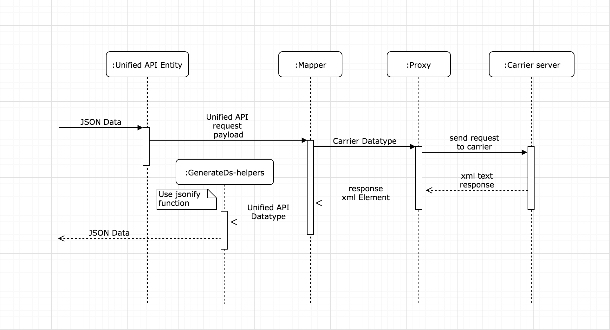

## JSON In ... JSON out



## Abstractions


## Domain

### Client

> The client holds all data related to specific carrier API credentials and configurations

```python
from purplship.mappers.dhl import  DHLClient

dhlClient = DHLClient(
  "https://xmlpi-ea.dhl.com/XMLShippingServlet",
  "YOUR_DHL_SITE_ID",
  "YOUR_DHL_SITE_PASSWORD",
  "YOUR_DHL_ACCOUNT_NUMBER",
  "CARRIER_NAME"              # optional, will be DHL by default
)
```

### Proxy

> The proxy takes care of the communication with the specific carrier's open API
>
> [Proxy Pattern](https://en.wikipedia.org/wiki/Proxy_pattern)

```python
from purplship.mappers.dhl import DHLProxy

dhlProxy = DHLProxy(dhlClient)
```

Or create a proxy with a custom mapper (If you extend or implement your own compatible Mapper).

```python
from purplship.mappers.dhl.dhl_mapper import DHLMapper

dhlMapper = DHLMapper(dhlClient)
customProxy = DHLProxy(dhlClient, dhlMapper)
```

### Mapper

> The mapper handles the conversion from PurplShip united API Data types to Carrier specific API Datatypes.
>
> Note: Here is the core of PurplShip extensibility and customizability. You can extend the default mapper or write your own.
>
> In most common cases the developer integrating a shipping carrier API has to write or extend mappers
>
> [Data mapper Pattern](https://martinfowler.com/eaaCatalog/dataMapper.html)


### Unified Data Models

> Defined by cross-referencing common data types among multiple carriers, the unified data types constitute an intuitive shared API interface.

Explore the library [API](/API) to know more about the type definitions.