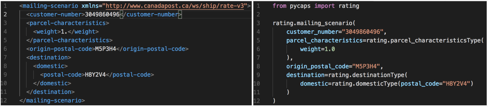

## JSON In ... JSON out


## Abstractions


## Domain

* Client
> The client holds all data related to specific carrier API credentials and configurations

```python
UPSClient(
  server_url="https://wwwcie.ups.com/webservices",
  username="username",
  password="password",
  account_number="56GJE",
  access_license_number="FG09H9G8H09GH8G0"
)
```

* Mapper
> The mapper handles the conversion from PurplShip united API Data types to Carrier specific API Datatypes.
>
> Note: Here is the core of PurplShip extensibility and customizability. You can extend the default mapper or write your own.
>
> In most common cases the developer integrating a shipping carrier API has to write or extend mappers
> [Data mapper Pattern](https://martinfowler.com/eaaCatalog/dataMapper.html)


* Proxy
> The proxy takes care of the communication with the specific carrier's open API
> [Proxy Pattern](https://en.wikipedia.org/wiki/Proxy_pattern)

* Unified Data Types
> Defined by cross-referencing common data types among multiple carriers, the unified data types constitute an intuitive shared API interface.

Explore the library [reference](/reference) to know more about the type definitions.