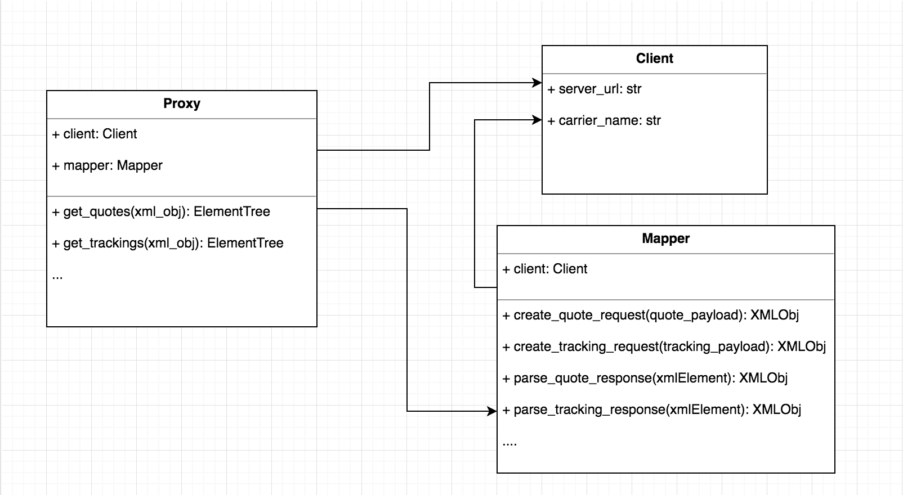

## JSON In ... JSON out

## Abstractions

Layers of abstraction |
--- |
Proxy |
Client, Mapper |
Generated Data Types (from Carriers specifications) |

## Domain

* Client
> The client holds all data related to specific carrier API credentials and configurations
>
> eg: FedexClient("API_URL", "FEDEX_USER_KEY", "FEDEX_PASSWORD", "FEDEX_ACCOUNT_NUMBER", "FEDEX_METER_NUMBER", "CARRIER_NAME")

* Mapper
> The mapper handles the conversion from OpenShip united API Data types to Carrier specific API Datatypes.
>
> Note: Here is the core of OpenShip extensibility and customizability. You can extend the default mapper or write your own.
>
> In most common cases the developer integrating a shipping carrier API has to write or extend mappers

* Proxy
> The proxy takes care of the communication with the specific carrier open API

* Unified Data Types
> Defined by cross-referencing common data types among multiple carriers, the unified data types constitute a meaningful shared API interface.