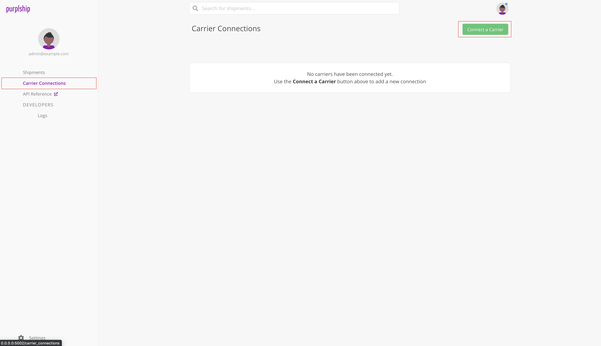
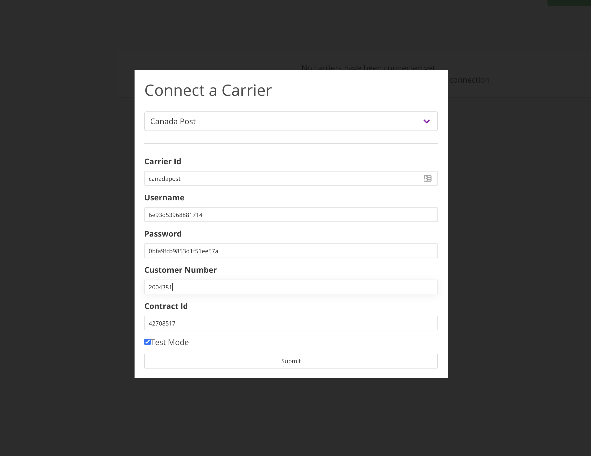
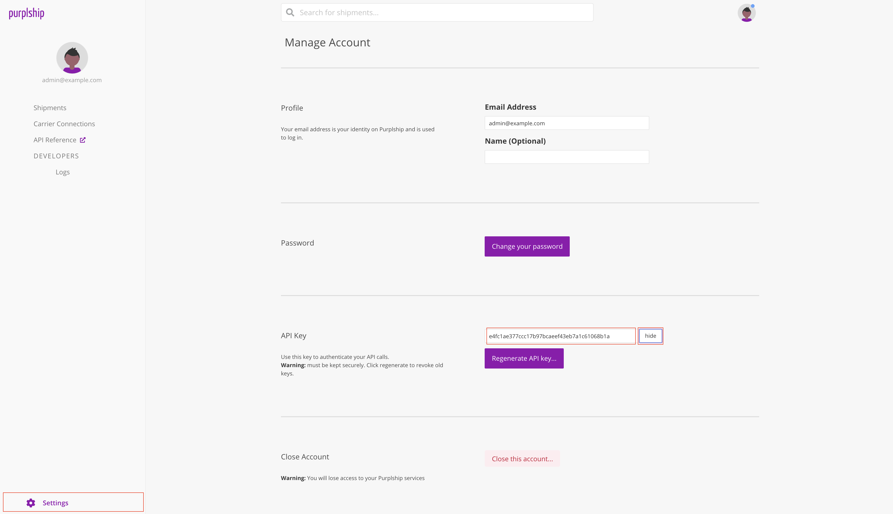

# Quick Start <!-- {docsify-ignore} -->

Purplship gets you started easily while offering advanced options for complex carrier services requirements.

<details>
<summary>If you don't have an existing account, download easily a Purplship server preview locally</summary>

These instructions will get you started with purplship server in a clean and isolated environment.

- start a postgres SQL Database Instance

```shell
docker run -d --name db -e POSTGRES_USER=postgres -e POSTGRES_PASSWORD=postgres postgres
```

- start the purplship-server docker container

```shell
docker run --name purplship --link=db:db -p5002:5002 purplship/purplship-server:[version]
```

---

</details>

## Carrier Connections

- Sign Into your Purplship server
- Access the carrier connection page to connect your carriers



### Connects a carrier account

Press the Add button under PROVIDERS > [CARRIER] Settings to add a carrier configuration settings.

*For this tutorial, we will add a Canada Post sandbox connection*

- Press the `Connect a Carrier` button to add a token attached to a user.



!> **Note that these credential are for testing purpose and used only to access Canda Post sandbox server.**

---

## API Connection

The core of Purplship is it's simple API which offers a unified API to communicate with any supported shipping carrier systems.

> - Read our [API Reference](https://purplship.com/openapi/) to discover all available APIs
> - Follow the [API Guide](/v2020.12/guides/reference?id=reference) to use Purplship to automate your logistics processes

### Retrieve your API Key

- Access the Settings page to retrieve the token
- Click the reveal buton in the `API Key` section and copy the token



### Test your connection

<!-- tabs:start -->

#### **cURL**

```shell
curl --request GET \
  --url https://instance.purplship.com/v1/references \
  --header 'Authorization: Token <API_KEY>'
```

#### **References**

```json
{
  "countries": {
    "AD": "ANDORRA",
    "AE": "UNITED ARAB EMIRATES",
    "AF": "AFGHANISTAN",
    "AG": "ANTIGUA",
    "AI": "ANGUILLA",
    "AL": "ALBANIA",
    "AM": "ARMENIA",
    "AN": "NETHERLANDS ANTILLES",
    "AO": "ANGOLA",
    "AR": "ARGENTINA",
    "AS": "AMERICAN SAMOA",
    "AT": "AUSTRIA",
    "AU": "AUSTRALIA",
    "AW": "ARUBA",
    "AZ": "AZERBAIJAN",
    "BA": "BOSNIA AND HERZEGOVINA",
    "BB": "BARBADOS",
    "BD": "BANGLADESH",
    "BE": "BELGIUM",
    "BF": "BURKINA FASO",
    "BG": "BULGARIA",
    "BH": "BAHRAIN",
    "BI": "BURUNDI",
    "BJ": "BENIN",
    "BM": "BERMUDA",
    "BN": "BRUNEI",
    "BO": "BOLIVIA",
    "BR": "BRAZIL",
    "BS": "BAHAMAS",
    "BT": "BHUTAN",
    "BW": "BOTSWANA",
    "BY": "BELARUS",
    "BZ": "BELIZE",
    "CA": "CANADA",
    "CD": "CONGO, THE DEMOCRATIC REPUBLIC OF",
    "CF": "CENTRAL AFRICAN REPUBLIC",
    "CG": "CONGO",
    "CH": "SWITZERLAND",
    "CI": "COTE D IVOIRE",
    "CK": "COOK ISLANDS",
    "CL": "CHILE",
    "CM": "CAMEROON",
    "CN": "CHINA, PEOPLES REPUBLIC",
    "CO": "COLOMBIA",
    "CR": "COSTA RICA",
    "CU": "CUBA",
    "CV": "CAPE VERDE",
    "CY": "CYPRUS",
    "CZ": "CZECH REPUBLIC, THE",
    "DE": "GERMANY",
    "DJ": "DJIBOUTI",
    "DK": "DENMARK",
    "DM": "DOMINICA",
    "DO": "DOMINICAN REPUBLIC",
    "DZ": "ALGERIA",
    "EC": "ECUADOR",
    "EE": "ESTONIA",
    "EG": "EGYPT",
    "ER": "ERITREA",
    "ES": "SPAIN",
    "ET": "ETHIOPIA",
    "FI": "FINLAND",
    "FJ": "FIJI",
    "FK": "FALKLAND ISLANDS",
    "FM": "MICRONESIA, FEDERATED STATES OF",
    "FO": "FAROE ISLANDS",
    "FR": "FRANCE",
    "GA": "GABON",
    "GB": "UNITED KINGDOM",
    "GD": "GRENADA",
    "GE": "GEORGIA",
    "GF": "FRENCH GUYANA",
    "GG": "GUERNSEY",
    "GH": "GHANA",
    "GI": "GIBRALTAR",
    "GL": "GREENLAND",
    "GM": "GAMBIA",
    "GN": "GUINEA REPUBLIC",
    "GP": "GUADELOUPE",
    "GQ": "GUINEA-EQUATORIAL",
    "GR": "GREECE",
    "GT": "GUATEMALA",
    "GU": "GUAM",
    "GW": "GUINEA-BISSAU",
    "GY": "GUYANA (BRITISH)",
    "HK": "HONG KONG",
    "HN": "HONDURAS",
    "HR": "CROATIA",
    "HT": "HAITI",
    "HU": "HUNGARY",
    "IC": "CANARY ISLANDS, THE",
    "ID": "INDONESIA",
    "IE": "IRELAND, REPUBLIC OF",
    "IL": "ISRAEL",
    "IN": "INDIA",
    "IQ": "IRAQ",
    "IR": "IRAN (ISLAMIC REPUBLIC OF)",
    "IS": "ICELAND",
    "IT": "ITALY",
    "JE": "JERSEY",
    "JM": "JAMAICA",
    "JO": "JORDAN",
    "JP": "JAPAN",
    "KE": "KENYA",
    "KG": "KYRGYZSTAN",
    "KH": "CAMBODIA",
    "KI": "KIRIBATI",
    "KM": "COMOROS",
    "KN": "ST. KITTS",
    "KP": "KOREA, THE D.P.R OF (NORTH K.)",
    "KR": "KOREA, REPUBLIC OF (SOUTH K.)",
    "KV": "KOSOVO",
    "KW": "KUWAIT",
    "KY": "CAYMAN ISLANDS",
    "KZ": "KAZAKHSTAN",
    "LA": "LAO PEOPLES DEMOCRATIC REPUBLIC",
    "LB": "LEBANON",
    "LC": "ST. LUCIA",
    "LI": "LIECHTENSTEIN",
    "LK": "SRI LANKA",
    "LR": "LIBERIA",
    "LS": "LESOTHO",
    "LT": "LITHUANIA",
    "LU": "LUXEMBOURG",
    "LV": "LATVIA",
    "LY": "LIBYA",
    "MA": "MOROCCO",
    "MC": "MONACO",
    "MD": "MOLDOVA, REPUBLIC OF",
    "ME": "MONTENEGRO, REPUBLIC OF",
    "MG": "MADAGASCAR",
    "MH": "MARSHALL ISLANDS",
    "MK": "MACEDONIA, REPUBLIC OF",
    "ML": "MALI",
    "MM": "MYANMAR",
    "MN": "MONGOLIA",
    "MO": "MACAU",
    "MP": "COMMONWEALTH NO. MARIANA ISLANDS",
    "MQ": "MARTINIQUE",
    "MR": "MAURITANIA",
    "MS": "MONTSERRAT",
    "MT": "MALTA",
    "MU": "MAURITIUS",
    "MV": "MALDIVES",
    "MW": "MALAWI",
    "MX": "MEXICO",
    "MY": "MALAYSIA",
    "MZ": "MOZAMBIQUE",
    "NA": "NAMIBIA",
    "NC": "NEW CALEDONIA",
    "NE": "NIGER",
    "NG": "NIGERIA",
    "NI": "NICARAGUA",
    "NL": "NETHERLANDS, THE",
    "NO": "NORWAY",
    "NP": "NEPAL",
    "NR": "NAURU, REPUBLIC OF",
    "NU": "NIUE",
    "NZ": "NEW ZEALAND",
    "OM": "OMAN",
    "PA": "PANAMA",
    "PE": "PERU",
    "PF": "TAHITI",
    "PG": "PAPUA NEW GUINEA",
    "PH": "PHILIPPINES, THE",
    "PK": "PAKISTAN",
    "PL": "POLAND",
    "PR": "PUERTO RICO",
    "PT": "PORTUGAL",
    "PW": "PALAU",
    "PY": "PARAGUAY",
    "QA": "QATAR",
    "RE": "REUNION, ISLAND OF",
    "RO": "ROMANIA",
    "RS": "SERBIA, REPUBLIC OF",
    "RU": "RUSSIAN FEDERATION, THE",
    "RW": "RWANDA",
    "SA": "SAUDI ARABIA",
    "SB": "SOLOMON ISLANDS",
    "SC": "SEYCHELLES",
    "SD": "SUDAN",
    "SE": "SWEDEN",
    "SG": "SINGAPORE",
    "SH": "SAINT HELENA",
    "SI": "SLOVENIA",
    "SK": "SLOVAKIA",
    "SL": "SIERRA LEONE",
    "SM": "SAN MARINO",
    "SN": "SENEGAL",
    "SO": "SOMALIA",
    "SR": "SURINAME",
    "SS": "SOUTH SUDAN",
    "ST": "SAO TOME AND PRINCIPE",
    "SV": "EL SALVADOR",
    "SY": "SYRIA",
    "SZ": "SWAZILAND",
    "TC": "TURKS AND CAICOS ISLANDS",
    "TD": "CHAD",
    "TG": "TOGO",
    "TH": "THAILAND",
    "TJ": "TAJIKISTAN",
    "TL": "TIMOR LESTE",
    "TN": "TUNISIA",
    "TO": "TONGA",
    "TR": "TURKEY",
    "TT": "TRINIDAD AND TOBAGO",
    "TV": "TUVALU",
    "TW": "TAIWAN",
    "TZ": "TANZANIA",
    "UA": "UKRAINE",
    "UG": "UGANDA",
    "US": "UNITED STATES OF AMERICA",
    "UY": "URUGUAY",
    "UZ": "UZBEKISTAN",
    "VA": "VATICAN CITY STATE",
    "VC": "ST. VINCENT",
    "VE": "VENEZUELA",
    "VG": "VIRGIN ISLANDS (BRITISH)",
    "VI": "VIRGIN ISLANDS (US)",
    "VN": "VIETNAM",
    "VU": "VANUATU",
    "WS": "SAMOA",
    "XB": "BONAIRE",
    "XC": "CURACAO",
    "XE": "ST. EUSTATIUS",
    "XM": "ST. MAARTEN",
    "XN": "NEVIS",
    "XS": "SOMALILAND, REP OF (NORTH SOMALIA)",
    "XY": "ST. BARTHELEMY",
    "YE": "YEMEN, REPUBLIC OF",
    "YT": "MAYOTTE",
    "ZA": "SOUTH AFRICA",
    "ZM": "ZAMBIA",
    "ZW": "ZIMBABWE"
  },
  "currencies": {
    "EUR": "Euro",
    "AED": "UAE Dirham",
    "USD": "US Dollar",
    "XCD": "East Caribbean Dollar",
    "AMD": "Dran",
    "ANG": "Netherlands Antilles Guilder",
    "AOA": "Kwanza",
    "ARS": "Argentine Peso",
    "AUD": "Australian Dollar",
    "AWG": "Aruba Guilder",
    "AZN": "Manat",
    "BAM": "Convertible Marks",
    "BBD": "Barbadian Dollar",
    "BDT": "Taka",
    "XOF": "CFA Franc West Africa",
    "BGN": "Bulgarian Lev",
    "BHD": "Bahraini Dinar",
    "BIF": "Burundese Franc",
    "BMD": "Bermudian Dollar",
    "BND": "Brunei Dollar",
    "BOB": "Boliviano",
    "BRL": "Real",
    "BSD": "Bahamian Dollar",
    "BTN": "Ngultrum",
    "BWP": "Pula",
    "BYN": "Belarussian Ruble",
    "BZD": "Belize Dollar",
    "CAD": "Canadian Dollar",
    "CDF": "Franc Congolais",
    "XAF": "CFA Franc Central Africa",
    "CHF": "Swiss Franc",
    "NZD": "New Zealand Dollar",
    "CLP": "New Chile Peso",
    "CNY": "Yuan (Ren Min Bi)",
    "COP": "Colombian Peso",
    "CRC": "Costa Rican Colon",
    "CUC": "Peso Convertible",
    "CVE": "Cape Verde Escudo",
    "CZK": "Czech Koruna",
    "DJF": "Djibouti Franc",
    "DKK": "Danish Krone",
    "DOP": "Dominican Republic Peso",
    "DZD": "Algerian Dinar",
    "EGP": "Egyptian Pound",
    "ERN": "Nakfa",
    "ETB": "Birr",
    "FJD": "Fijian Dollar",
    "GBP": "Pound Sterling",
    "GEL": "Georgian Lari",
    "GHS": "Cedi",
    "GMD": "Dalasi",
    "GNF": "Guinea Franc",
    "GTQ": "Quetzal",
    "GYD": "Guyanan Dollar",
    "HKD": "Hong Kong Dollar",
    "HNL": "Lempira",
    "HRK": "Croatian Kuna",
    "HTG": "Gourde",
    "HUF": "Forint",
    "IDR": "Rupiah",
    "ILS": "New Israeli Shekel",
    "INR": "Indian Rupee",
    "IRR": "Iranian Rial",
    "ISK": "Icelandic Krona",
    "JMD": "Jamaican Dollar",
    "JOD": "Jordanian Dinar",
    "JPY": "Yen",
    "KES": "Kenyan Shilling",
    "KGS": "Som",
    "KHR": "Khmer Rial",
    "KMF": "Comoros Franc",
    "KPW": "North Korean Won",
    "KRW": "Won",
    "KWD": "Kuwaiti Dinar",
    "KYD": "Cayman Islands Dollar",
    "KZT": "Tenge",
    "LAK": "Kip",
    "LKR": "Sri Lankan Rupee",
    "LRD": "Liberian Dollar",
    "LSL": "Loti",
    "LYD": "Libyan Dinar",
    "MAD": "Moroccan Dirham",
    "MDL": "Leu",
    "MGA": "Ariary",
    "MKD": "Denar",
    "MMK": "Kyat",
    "MNT": "Tugrik",
    "MOP": "Pataca",
    "MRO": "Ouguiya",
    "MUR": "Mauritius Rupee",
    "MVR": "Rufiyaa",
    "MWK": "Kwacha",
    "MXN": "Mexican Nuevo Peso",
    "MYR": "Ringgit",
    "MZN": "Mozambique Metical",
    "NAD": "Namibian Dollar",
    "XPF": "CFP Franc",
    "NGN": "Naira",
    "NIO": "Cordoba Oro",
    "NOK": "Norwegian Krone",
    "NPR": "Nepalese Rupee",
    "OMR": "Omani Rial",
    "PEN": "Nuevo Sol",
    "PGK": "Kina",
    "PHP": "Phillipines Peso",
    "PKR": "Pakistani Rupee",
    "PLN": "Zloty",
    "PYG": "Guarani",
    "QAR": "Qatar Rial",
    "RSD": "Serbia, Dinars",
    "RUB": "Russian Ruble",
    "RWF": "Rwanda Franc",
    "SAR": "Saudi Riyal",
    "SBD": "Solomon Islands Dollar",
    "SCR": "Seychelles Rupee",
    "SDG": "Sudanese Pound",
    "SEK": "Swedish Krona",
    "SGD": "Singapore Dollar",
    "SHP": "St. Helena Pound",
    "SLL": "Leone",
    "SOS": "Somali Shilling",
    "SRD": "Suriname Dollar",
    "SSP": "South Sudanese pound",
    "STD": "Dobra",
    "SYP": "Syrian Pound",
    "SZL": "Lilangeni",
    "THB": "Baht",
    "TJS": "Somoni",
    "TND": "Tunisian Dinar",
    "TOP": "Pa'anga",
    "TRY": "New Turkish Lira",
    "TTD": "Trinidad and Tobago Dollar",
    "TWD": "New Taiwan Dollar",
    "TZS": "Tanzanian Shilling",
    "UAH": "Hryvna",
    "UYU": "Peso Uruguayo",
    "UZS": "Sum",
    "VEF": "Bolivar Fuerte",
    "VND": "Dong",
    "VUV": "Vanuatu Vatu",
    "WST": "Tala",
    "YER": "Yemeni Riyal",
    "ZAR": "South African Rand"
  },
  "states": {
    "AE": {
      "AB": "Abu Dhabi",
      "AJ": "Ajman",
      "DU": "Dubai",
      "FU": "Fujairah",
      "RA": "Ras al-Khaimah",
      "SH": "Sharjah",
      "UM": "Umm al-Qaiwain"
    },
    "CA": {
      "AB": "Alberta",
      "BC": "British Columbia",
      "MB": "Manitoba",
      "NB": "New Brunswick",
      "NL": "Newfoundland",
      "NT": "Northwest Territories",
      "NS": "Nova Scotia",
      "NU": "Nunavut",
      "ON": "Ontario",
      "PE": "Prince Edward Island",
      "QC": "Quebec",
      "SK": "Saskatchewan",
      "YT": "Yukon"
    },
    "CN": {
      "anhui": "Anhui",
      "hainan": "Hainan",
      "jiangxi": "Jiangxi",
      "shanghai": "Shanghai",
      "beijing": "Beijing",
      "hebei": "Hebei",
      "jilin": "Jilin",
      "shanxi": "Shanxi",
      "chongqing": "Chongqing",
      "heilongjiang": "Heilongjiang",
      "liaoning": "Liaoning",
      "sichuan": "Sichuan",
      "fujian": "Fujian",
      "henan": "Henan",
      "nei_mongol": "Nei Mongol",
      "tianjin": "Tianjin",
      "gansu": "Gansu",
      "hubei": "Hubei",
      "qinghai": "Qinghai",
      "xinjiang": "Xinjiang",
      "guangdong": "Guangdong",
      "hunan": "Hunan",
      "shaanxi": "Shaanxi",
      "yunnan": "Yunnan",
      "guizhou": "Guizhou",
      "jiangsu": "Jiangsu",
      "shandong": "Shandong",
      "zhejiang": "Zhejiang"
    },
    "IN": {
      "AN": "Andaman & Nicobar (U.T)",
      "AP": "Andhra Pradesh",
      "AR": "Arunachal Pradesh",
      "AS": "Assam",
      "BR": "Bihar",
      "CG": "Chattisgarh",
      "CH": "Chandigarh (U.T.)",
      "DD": "Daman & Diu (U.T.)",
      "DL": "Delhi (U.T.)",
      "DN": "Dadra and Nagar Haveli (U.T.)",
      "GA": "Goa",
      "GJ": "Gujarat",
      "HP": "Himachal Pradesh",
      "HR": "Haryana",
      "JH": "Jharkhand",
      "JK": "Jammu & Kashmir",
      "KA": "Karnataka",
      "KL": "Kerala",
      "LD": "Lakshadweep (U.T)",
      "MH": "Maharashtra",
      "ML": "Meghalaya",
      "MN": "Manipur",
      "MP": "Madhya Pradesh",
      "MZ": "Mizoram",
      "NL": "Nagaland",
      "OR": "Orissa",
      "PB": "Punjab",
      "PY": "Puducherry (U.T.)",
      "RJ": "Rajasthan",
      "SK": "Sikkim",
      "TN": "Tamil Nadu",
      "TR": "Tripura",
      "UA": "Uttaranchal",
      "UP": "Uttar Pradesh",
      "WB": "West Bengal"
    },
    "MX": {
      "AG": "Aguascalientes",
      "BC": "Baja California",
      "BS": "Baja California Sur",
      "CM": "Campeche",
      "CS": "Chiapas",
      "CH": "Chihuahua",
      "CO": "Coahuila",
      "CL": "Colima",
      "DF": "Ciudad de México",
      "DG": "Durango",
      "GT": "Guanajuato",
      "GR": "Guerrero",
      "HG": "Hidalgo",
      "JA": "Jalisco",
      "EM": "Estado de México",
      "MI": "Michoacán",
      "MO": "Morelos",
      "NA": "Nayarit",
      "NL": "Nuevo León",
      "OA": "Oaxaca",
      "PU": "Puebla",
      "QE": "Querétaro",
      "QR": "Quintana Roo",
      "SL": "San Luis Potosí",
      "SI": "Sinaloa",
      "SO": "Sonora",
      "TB": "Tabasco",
      "TM": "Tamaulipas",
      "TL": "Tlaxcala",
      "VE": "Veracruz",
      "YU": "Yucatán",
      "ZA": "Zacatecas"
    },
    "US": {
      "AL": "Alabama",
      "AK": "Alaska",
      "AZ": "Arizona",
      "AR": "Arkansas",
      "CA": "California",
      "CO": "Colorado",
      "CT": "Connecticut",
      "DE": "Delaware",
      "DC": "District of Columbia",
      "FL": "Florida",
      "GA": "Georgia",
      "HI": "Hawaii",
      "ID": "Idaho",
      "IL": "Illinois",
      "IN": "Indiana",
      "IA": "Iowa",
      "KS": "Kansas",
      "KY": "Kentucky",
      "LA": "Louisiana",
      "ME": "Maine",
      "MD": "Maryland",
      "MA": "Massachusetts",
      "MI": "Michigan",
      "MN": "Minnesota",
      "MS": "Mississippi",
      "MO": "Missouri",
      "MT": "Montana",
      "NE": "Nebraska",
      "NV": "Nevada",
      "NH": "New Hampshire",
      "NJ": "New Jersey",
      "NM": "New Mexico",
      "NY": "New York",
      "NC": "North Carolina",
      "ND": "North Dakota",
      "OH": "Ohio",
      "OK": "Oklahoma",
      "OR": "Oregon",
      "PA": "Pennsylvania",
      "RI": "Rhode Island",
      "SC": "South Carolina",
      "SD": "South Dakota",
      "TN": "Tennessee",
      "TX": "Texas",
      "UT": "Utah",
      "VT": "Vermont",
      "VA": "Virginia",
      "WA": "Washington State",
      "WV": "West Virginia",
      "WI": "Wisconsin",
      "WY": "Wyoming",
      "PR": "Puerto Rico"
    }
  },
  "carriers": {
    "canadapost": "Canada Post",
    "dhl_express": "DHL Express",
    "fedex_express": "FedEx Express",
    "purolator_courier": "Purolator Courier",
    "ups_package": "UPS Package",
    "freightcom": "Freightcom",
    "eshipper": "eShipper"
  },
  "services": {
    "canadapost": {
      "canadapost_regular_parcel": "DOM.RP",
      "canadapost_expedited_parcel": "DOM.EP",
      "canadapost_xpresspost": "DOM.XP",
      "canadapost_priority": "DOM.PC",
      "canadapost_library_books": "DOM.LIB",
      "canadapost_expedited_parcel_usa": "USA.EP",
      "canadapost_priority_worldwide_envelope_usa": "USA.PW.ENV",
      "canadapost_priority_worldwide_pak_usa": "USA.PW.PAK",
      "canadapost_priority_worldwide_parcel_usa": "USA.PW.PARCEL",
      "canadapost_small_packet_usa_air": "USA.SP.AIR",
      "canadapost_tracked_packet_usa": "USA.TP",
      "canadapost_tracked_packet_usa_lvm": "USA.TP.LVM",
      "canadapost_xpresspost_usa": "USA.XP",
      "canadapost_xpresspost_international": "INT.XP",
      "canadapost_international_parcel_air": "INT.IP.AIR",
      "canadapost_international_parcel_surface": "INT.IP.SURF",
      "canadapost_priority_worldwide_envelope_intl": "INT.PW.ENV",
      "canadapost_priority_worldwide_pak_intl": "INT.PW.PAK",
      "canadapost_priority_worldwide_parcel_intl": "INT.PW.PARCEL",
      "canadapost_small_packet_international_air": "INT.SP.AIR",
      "canadapost_small_packet_international_surface": "INT.SP.SURF",
      "canadapost_tracked_packet_international": "INT.TP"
    },
    "dhl_express": {
      "dhl_logistics_services": "LOGISTICS SERVICES",
      "dhl_domestic_express_12_00_doc": "DOMESTIC EXPRESS 12:00 DOC",
      "dhl_b2_c_doc": "B2C DOC",
      "dhl_b2_c_nondoc": "B2C NONDOC",
      "dhl_jetline": "JETLINE",
      "dhl_sprintline": "SPRINTLINE",
      "dhl_express_easy_doc": "EXPRESS EASY DOC",
      "dhl_express_easy_nondoc": "EXPRESS EASY NONDOC",
      "dhl_europack_doc": "EUROPACK DOC",
      "dhl_auto_reversals": "AUTO REVERSALS",
      "dhl_breakbulk_express_doc": "BREAKBULK EXPRESS DOC",
      "dhl_medical_express_doc": "MEDICAL EXPRESS DOC",
      "dhl_express_worldwide_doc": "EXPRESS WORLDWIDE DOC",
      "dhl_express_9_00_nondoc": "EXPRESS 9:00 NONDOC",
      "dhl_freight_worldwide_nondoc": "FREIGHT WORLDWIDE NONDOC",
      "dhl_domestic_economy_select_doc": "DOMESTIC ECONOMY SELECT DOC",
      "dhl_economy_select_nondoc": "ECONOMY SELECT NONDOC",
      "dhl_domestic_express_9_00_doc": "DOMESTIC EXPRESS 9:00 DOC",
      "dhl_jumbo_box_nondoc": "JUMBO BOX NONDOC",
      "dhl_express_9_00_doc": "EXPRESS 9:00 DOC",
      "dhl_express_10_30_doc": "EXPRESS 10:30 DOC",
      "dhl_express_10_30_nondoc": "EXPRESS 10:30 NONDOC",
      "dhl_domestic_express_doc": "DOMESTIC EXPRESS DOC",
      "dhl_domestic_express_10_30_doc": "DOMESTIC EXPRESS 10:30 DOC",
      "dhl_express_worldwide_nondoc": "EXPRESS WORLDWIDE NONDOC",
      "dhl_medical_express_nondoc": "MEDICAL EXPRESS NONDOC",
      "dhl_globalmail_business_doc": "GLOBALMAIL BUSINESS DOC",
      "dhl_same_day_doc": "SAME DAY DOC",
      "dhl_express_12_00_doc": "EXPRESS 12:00 DOC",
      "dhl_europack_nondoc": "EUROPACK NONDOC",
      "dhl_economy_select_doc": "ECONOMY SELECT DOC",
      "dhl_express_envelope_doc": "EXPRESS ENVELOPE DOC",
      "dhl_express_12_00_nondoc": "EXPRESS 12:00 NONDOC",
      "dhl_destination_charges": "Destination Charges"
    },
    "fedex_express": {
      "europe_first_international_priority": "EUROPE_FIRST_INTERNATIONAL_PRIORITY",
      "fedex_1_day_freight": "FEDEX_1_DAY_FREIGHT",
      "fedex_2_day": "FEDEX_2_DAY",
      "fedex_2_day_am": "FEDEX_2_DAY_AM",
      "fedex_2_day_freight": "FEDEX_2_DAY_FREIGHT",
      "fedex_3_day_freight": "FEDEX_3_DAY_FREIGHT",
      "fedex_cargo_airport_to_airport": "FEDEX_CARGO_AIRPORT_TO_AIRPORT",
      "fedex_cargo_freight_forwarding": "FEDEX_CARGO_FREIGHT_FORWARDING",
      "fedex_cargo_international_express_freight": "FEDEX_CARGO_INTERNATIONAL_EXPRESS_FREIGHT",
      "fedex_cargo_international_premium": "FEDEX_CARGO_INTERNATIONAL_PREMIUM",
      "fedex_cargo_mail": "FEDEX_CARGO_MAIL",
      "fedex_cargo_registered_mail": "FEDEX_CARGO_REGISTERED_MAIL",
      "fedex_cargo_surface_mail": "FEDEX_CARGO_SURFACE_MAIL",
      "fedex_custom_critical_air_expedite": "FEDEX_CUSTOM_CRITICAL_AIR_EXPEDITE",
      "fedex_custom_critical_air_expedite_exclusive_use": "FEDEX_CUSTOM_CRITICAL_AIR_EXPEDITE_EXCLUSIVE_USE",
      "fedex_custom_critical_air_expedite_network": "FEDEX_CUSTOM_CRITICAL_AIR_EXPEDITE_NETWORK",
      "fedex_custom_critical_charter_air": "FEDEX_CUSTOM_CRITICAL_CHARTER_AIR",
      "fedex_custom_critical_point_to_point": "FEDEX_CUSTOM_CRITICAL_POINT_TO_POINT",
      "fedex_custom_critical_surface_expedite": "FEDEX_CUSTOM_CRITICAL_SURFACE_EXPEDITE",
      "fedex_custom_critical_surface_expedite_exclusive_use": "FEDEX_CUSTOM_CRITICAL_SURFACE_EXPEDITE_EXCLUSIVE_USE",
      "fedex_custom_critical_temp_assure_air": "FEDEX_CUSTOM_CRITICAL_TEMP_ASSURE_AIR",
      "fedex_custom_critical_temp_assure_validated_air": "FEDEX_CUSTOM_CRITICAL_TEMP_ASSURE_VALIDATED_AIR",
      "fedex_custom_critical_white_glove_services": "FEDEX_CUSTOM_CRITICAL_WHITE_GLOVE_SERVICES",
      "fedex_distance_deferred": "FEDEX_DISTANCE_DEFERRED",
      "fedex_express_saver": "FEDEX_EXPRESS_SAVER",
      "fedex_first_freight": "FEDEX_FIRST_FREIGHT",
      "fedex_freight_economy": "FEDEX_FREIGHT_ECONOMY",
      "fedex_freight_priority": "FEDEX_FREIGHT_PRIORITY",
      "fedex_ground": "FEDEX_GROUND",
      "fedex_international_priority_plus": "FEDEX_INTERNATIONAL_PRIORITY_PLUS",
      "fedex_next_day_afternoon": "FEDEX_NEXT_DAY_AFTERNOON",
      "fedex_next_day_early_morning": "FEDEX_NEXT_DAY_EARLY_MORNING",
      "fedex_next_day_end_of_day": "FEDEX_NEXT_DAY_END_OF_DAY",
      "fedex_next_day_freight": "FEDEX_NEXT_DAY_FREIGHT",
      "fedex_next_day_mid_morning": "FEDEX_NEXT_DAY_MID_MORNING",
      "first_overnight": "FIRST_OVERNIGHT",
      "ground_home_delivery": "GROUND_HOME_DELIVERY",
      "international_distribution_freight": "INTERNATIONAL_DISTRIBUTION_FREIGHT",
      "international_economy": "INTERNATIONAL_ECONOMY",
      "international_economy_distribution": "INTERNATIONAL_ECONOMY_DISTRIBUTION",
      "international_economy_freight": "INTERNATIONAL_ECONOMY_FREIGHT",
      "international_first": "INTERNATIONAL_FIRST",
      "international_ground": "INTERNATIONAL_GROUND",
      "international_priority": "INTERNATIONAL_PRIORITY",
      "international_priority_distribution": "INTERNATIONAL_PRIORITY_DISTRIBUTION",
      "international_priority_express": "INTERNATIONAL_PRIORITY_EXPRESS",
      "international_priority_freight": "INTERNATIONAL_PRIORITY_FREIGHT",
      "priority_overnight": "PRIORITY_OVERNIGHT",
      "same_day": "SAME_DAY",
      "same_day_city": "SAME_DAY_CITY",
      "same_day_metro_afternoon": "SAME_DAY_METRO_AFTERNOON",
      "same_day_metro_morning": "SAME_DAY_METRO_MORNING",
      "same_day_metro_rush": "SAME_DAY_METRO_RUSH",
      "smart_post": "SMART_POST",
      "standard_overnight": "STANDARD_OVERNIGHT",
      "transborder_distribution_consolidation": "TRANSBORDER_DISTRIBUTION_CONSOLIDATION"
    },
    "purolator_courier": {
      "purolator_express_9_am": "PurolatorExpress9AM",
      "purolator_express_us": "PurolatorExpressU.S.",
      "purolator_express_10_30_am": "PurolatorExpress10:30AM",
      "purolator_express_us_9_am": "PurolatorExpressU.S.9AM",
      "purolator_express_12_pm": "PurolatorExpress12PM",
      "purolator_express_us_10_30_am": "PurolatorExpressU.S.10:30AM",
      "purolator_express": "PurolatorExpress",
      "purolator_express_us_12_00": "PurolatorExpressU.S.12:00",
      "purolator_express_evening": "PurolatorExpressEvening",
      "purolator_express_envelope_us": "PurolatorExpressEnvelopeU.S.",
      "purolator_express_envelope_9_am": "PurolatorExpressEnvelope9AM",
      "purolator_express_us_envelope_9_am": "PurolatorExpressU.S.Envelope9AM",
      "purolator_express_envelope_10_30_am": "PurolatorExpressEnvelope10:30AM",
      "purolator_express_us_envelope_10_30_am": "PurolatorExpressU.S.Envelope10:30AM",
      "purolator_express_envelope_12_pm": "PurolatorExpressEnvelope12PM",
      "purolator_express_us_envelope_12_00": "PurolatorExpressU.S.Envelope12:00",
      "purolator_express_envelope": "PurolatorExpressEnvelope",
      "purolator_express_pack_us": "PurolatorExpressPackU.S.",
      "purolator_express_envelope_evening": "PurolatorExpressEnvelopeEvening",
      "purolator_express_us_pack_9_am": "PurolatorExpressU.S.Pack9AM",
      "purolator_express_pack_9_am": "PurolatorExpressPack9AM",
      "purolator_express_us_pack_10_30_am": "PurolatorExpressU.S.Pack10:30AM",
      "purolator_express_pack10_30_am": "PurolatorExpressPack10:30AM",
      "purolator_express_us_pack_12_00": "PurolatorExpressU.S.Pack12:00",
      "purolator_express_pack_12_pm": "PurolatorExpressPack12PM",
      "purolator_express_box_us": "PurolatorExpressBoxU.S.",
      "purolator_express_pack": "PurolatorExpressPack",
      "purolator_express_us_box_9_am": "PurolatorExpressU.S.Box9AM",
      "purolator_express_pack_evening": "PurolatorExpressPackEvening",
      "purolator_express_us_box_10_30_am": "PurolatorExpressU.S.Box10:30AM",
      "purolator_express_box_9_am": "PurolatorExpressBox9AM",
      "purolator_express_us_box_12_00": "PurolatorExpressU.S.Box12:00",
      "purolator_express_box_10_30_am": "PurolatorExpressBox10:30AM",
      "purolator_ground_us": "PurolatorGroundU.S.",
      "purolator_express_box_12_pm": "PurolatorExpressBox12PM",
      "purolator_express_international": "PurolatorExpressInternational",
      "purolator_express_box": "PurolatorExpressBox",
      "purolator_express_international_9_am": "PurolatorExpressInternational9AM",
      "purolator_express_box_evening": "PurolatorExpressBoxEvening",
      "purolator_express_international_10_30_am": "PurolatorExpressInternational10:30AM",
      "purolator_ground": "PurolatorGround",
      "purolator_express_international_12_00": "PurolatorExpressInternational12:00",
      "purolator_ground9_am": "PurolatorGround9AM",
      "purolator_express_envelope_international": "PurolatorExpressEnvelopeInternational",
      "purolator_ground10_30_am": "PurolatorGround10:30AM",
      "purolator_express_international_envelope_9_am": "PurolatorExpressInternationalEnvelope9AM",
      "purolator_ground_evening": "PurolatorGroundEvening",
      "purolator_express_international_envelope_10_30_am": "PurolatorExpressInternationalEnvelope10:30AM",
      "purolator_quick_ship": "PurolatorQuickShip",
      "purolator_express_international_envelope_12_00": "PurolatorExpressInternationalEnvelope12:00",
      "purolator_quick_ship_envelope": "PurolatorQuickShipEnvelope",
      "purolator_express_pack_international": "PurolatorExpressPackInternational",
      "purolator_quick_ship_pack": "PurolatorQuickShipPack",
      "purolator_express_international_pack_9_am": "PurolatorExpressInternationalPack9AM",
      "purolator_quick_ship_box": "PurolatorQuickShipBox",
      "purolator_express_international_pack_10_30_am": "PurolatorExpressInternationalPack10:30AM",
      "purolator_express_international_pack_12_00": "PurolatorExpressInternationalPack12:00",
      "purolator_express_box_international": "PurolatorExpressBoxInternational",
      "purolator_express_international_box_9_am": "PurolatorExpressInternationalBox9AM",
      "purolator_express_international_box_10_30_am": "PurolatorExpressInternationalBox10:30AM",
      "purolator_express_international_box_12_00": "PurolatorExpressInternationalBox12:00"
    },
    "ups_package": {
      "ups_standard": "11",
      "ups_worldwide_expedited": "08",
      "ups_worldwide_express": "07",
      "ups_worldwide_express_plus": "54",
      "ups_worldwide_saver": "65",
      "ups_2nd_day_air": "02",
      "ups_2nd_day_air_am": "59",
      "ups_3_day_select": "12",
      "ups_expedited_mail_innovations": "M4",
      "ups_first_class_mail": "M2",
      "ups_ground": "03",
      "ups_next_day_air": "01",
      "ups_next_day_air_early": "14",
      "ups_next_day_air_saver": "13",
      "ups_priority_mail": "M3",
      "ups_access_point_economy": "70",
      "ups_today_dedicated_courier": "83",
      "ups_today_express": "85",
      "ups_today_express_saver": "86",
      "ups_today_standard": "82",
      "ups_worldwide_express_freight": "96",
      "ups_priority_mail_innovations": "M5",
      "ups_economy_mail_innovations": "M6"
    },
    "freightcom": {
      "freightcom_central_transport": "2029",
      "freigthcom_estes": "2107",
      "freigthcom_usf_holland": "1911",
      "freightcom_fedex_ground": "4101",
      "freightcom_ups_standard": "4600",
      "freightcom_fedex_2_day": "4102",
      "freightcom_fedex_priority_overnight": "4104",
      "freightcom_fedex_standard_overnight": "4105",
      "freightcom_ground": "3400",
      "freightcom_ups_expedited": "4601",
      "freightcom_ups_express_saver": "4602",
      "freightcom_ups_express": "4603",
      "freightcom_fedex_express_saver": "4100",
      "freightcom_ups_express_early": "4604",
      "freightcom_select": "3404",
      "freightcom_dayr_e_comm_ground_service": "5707",
      "freightcom_overnight": "3407",
      "freightcom_purolator_ground": "4000",
      "freightcom_purolator_express": "4003",
      "freightcom_purolator_express_10_30_am": "4005",
      "freightcom_fedex_first_overnight": "4106",
      "freightcom_purolator_express_9_am": "4004",
      "freightcom_dayr_e_comm_am_service": "5706"
    },
    "eshipper": {
      "eshipper_fedex_priority": "1",
      "eshipper_fedex_first_overnight": "2",
      "eshipper_fedex_ground": "3",
      "eshipper_fedex_standard_overnight": "28",
      "eshipper_fedex_2nd_day": "29",
      "eshipper_fedex_express_saver": "30",
      "eshipper_purolator_air": "4",
      "eshipper_purolator_air_9_am": "5",
      "eshipper_purolator_air_10_30": "6",
      "eshipper_puroletter": "7",
      "eshipper_puroletter_9_am": "8",
      "eshipper_puroletter_10_30": "9",
      "eshipper_puro_pak": "10",
      "eshipper_puro_pak_9_am": "11",
      "eshipper_puro_pak_10_30": "12",
      "eshipper_purolator_ground": "13",
      "eshipper_purolator_ground_9_am": "19",
      "eshipper_purolator_ground_10_30": "20",
      "eshipper_canada_worldwide_same_day": "14",
      "eshipper_canada_worldwide_next_flight_out": "15",
      "eshipper_canada_worldwide_air_freight": "16",
      "eshipper_canada_worldwide_ltl": "17",
      "eshipper_dhl_international_express": "106",
      "eshipper_ups_express_next_day_air": "600",
      "eshipper_ups_expedited_second_day_air": "601",
      "eshipper_ups_worldwide_express": "602",
      "eshipper_ups_worldwide_expedited": "603",
      "eshipper_ups_standard_ground": "604",
      "eshipper_ups_express_early_am_next_day_air_early_am": "605",
      "eshipper_ups_three_day_select": "606",
      "eshipper_ups_saver": "607",
      "eshipper_ups_ground": "608",
      "eshipper_next_day_saver": "609",
      "eshipper_worldwide_express_plus": "610",
      "eshipper_second_day_air_am": "611",
      "eshipper_canada_post_priority": "500",
      "eshipper_canada_post_xpress_post": "501",
      "eshipper_canada_post_expedited": "502",
      "eshipper_canada_post_regular": "503",
      "eshipper_canada_post_xpress_post_usa": "504",
      "eshipper_canada_post_xpress_post_intl": "505",
      "eshipper_canada_post_air_parcel_intl": "506",
      "eshipper_canada_post_surface_parcel_intl": "507",
      "eshipper_canada_post_expedited_parcel_usa": "508",
      "eshipper_tst_ltl": "1100",
      "eshipper_ltl_chicago_suburban_express": "1500",
      "eshipper_ltl_fedex_freight_east": "1501",
      "eshipper_ltl_fedex_freight_west": "1502",
      "eshipper_ltl_mid_states_express": "1503",
      "eshipper_ltl_new_england_motor_freight": "1504",
      "eshipper_ltl_new_penn": "1505",
      "eshipper_ltl_oak_harbor": "1506",
      "eshipper_ltl_pitt_ohio": "1507",
      "eshipper_ltl_r_l_carriers": "1508",
      "eshipper_ltl_saia": "1509",
      "eshipper_ltl_usf_reddaway": "1510",
      "eshipper_ltl_vitran_express": "1511",
      "eshipper_ltl_wilson_trucking": "1512",
      "eshipper_ltl_yellow_transportation": "1513",
      "eshipper_ltl_roadway": "1514",
      "eshipper_ltl_fedex_national": "1515",
      "eshipper_wilson_trucking_tfc": "1800",
      "eshipper_aaa_cooper_transportation": "1801",
      "eshipper_roadrunner_dawes": "1802",
      "eshipper_new_england_motor_freight": "1803",
      "eshipper_new_penn_motor_express": "1804",
      "eshipper_dayton_freight": "1805",
      "eshipper_southeastern_freightway": "1806",
      "eshipper_saia_inc": "1807",
      "eshipper_conway": "1808",
      "eshipper_roadway": "1809",
      "eshipper_usf_reddaway": "1810",
      "eshipper_usf_holland": "1811",
      "eshipper_dependable_highway_express": "1812",
      "eshipper_day_and_ross": "1813",
      "eshipper_day_and_ross_r_and_l": "1814",
      "eshipper_ups": "1815",
      "eshipper_aaa_cooper": "1816",
      "eshipper_ama_transportation": "1817",
      "eshipper_averitt_express": "1818",
      "eshipper_central_freight": "1819",
      "eshipper_conway_us": "1820",
      "eshipper_dayton": "1821",
      "eshipper_drug_transport": "1822",
      "eshipper_estes": "1823",
      "eshipper_land_air_express": "1824",
      "eshipper_fedex_west": "1825",
      "eshipper_fedex_national": "1826",
      "eshipper_usf_holland_us": "1827",
      "eshipper_lakeville_m_express": "1828",
      "eshipper_milan_express": "1829",
      "eshipper_nebraska_transport": "1830",
      "eshipper_new_england": "1831",
      "eshipper_new_penn": "1832",
      "eshipper_a_duie_pyle": "1833",
      "eshipper_roadway_us": "1834",
      "eshipper_usf_reddaway_us": "1835",
      "eshipper_rhody_transportation": "1836",
      "eshipper_saia_motor_freight": "1837",
      "eshipper_southeastern_frgt": "1838",
      "eshipper_pitt_ohio": "1839",
      "eshipper_ward": "1840",
      "eshipper_wilson": "1841",
      "eshipper_chi_cargo": "1842",
      "eshipper_tax_air": "1843",
      "eshipper_fedex_east": "1844",
      "eshipper_central_transport": "1845",
      "eshipper_roadrunner": "1846",
      "eshipper_r_and_l_carriers": "1847",
      "eshipper_estes_us": "1848",
      "eshipper_yrc_roadway": "1849",
      "eshipper_central_transport_us": "1850",
      "eshipper_absolute_transportation_services": "1851",
      "eshipper_blue_sky_express": "1852",
      "eshipper_galasso_trucking": "1853",
      "eshipper_griley_air_freight": "1854",
      "eshipper_jet_transportation": "1855",
      "eshipper_metro_transportation_logistics": "1856",
      "eshipper_oak_harbor": "1857",
      "eshipper_stream_links_express": "1858",
      "eshipper_tiffany_trucking": "1859",
      "eshipper_ups_freight": "1860",
      "eshipper_roadrunner_us": "1861",
      "eshipper_global_mail_parcel_priority": "3500",
      "eshipper_global_mail_parcel_standard": "3501",
      "eshipper_global_mail_packet_plus_priority": "3502",
      "eshipper_global_mail_packet_priority": "3503",
      "eshipper_global_mail_packet_standard": "3504",
      "eshipper_global_mail_business_priority": "3505",
      "eshipper_global_mail_business_standard": "3506",
      "eshipper_global_mail_parcel_direct_priority": "3507",
      "eshipper_global_mail_parcel_direct_standard": "3508",
      "eshipper_ground": "4500",
      "eshipper_select_parcel": "4504",
      "eshipper_express_parcel": "4507"
    }
  },
  "options": {
    "canadapost": {
      "canadapost_signature": "SO",
      "canadapost_coverage": "COV",
      "canadapost_collect_on_delivery": "COD",
      "canadapost_proof_of_age_required_18": "PA18",
      "canadapost_proof_of_age_required_19": "PA19",
      "canadapost_card_for_pickup": "HFP",
      "canadapost_do_not_safe_drop": "DNS",
      "canadapost_leave_at_door": "LAD",
      "canadapost_deliver_to_post_office": "D2PO",
      "canadapost_return_at_senders_expense": "RASE",
      "canadapost_return_to_sender": "RTS",
      "canadapost_abandon": "ABAN"
    },
    "dhl_express": {
      "dhl_logistics_services": "0A",
      "dhl_mailroom_management": "0B",
      "dhl_pallet_administration": "0C",
      "dhl_warehousing": "0D",
      "dhl_express_logistics_centre": "0E",
      "dhl_strategic_parts_centre": "0F",
      "dhl_local_distribution_centre": "0G",
      "dhl_terminal_handling": "0H",
      "dhl_cross_docking": "0I",
      "dhl_inventory_management": "0J",
      "dhl_loading_unloading": "0K",
      "dhl_product_kitting": "0L",
      "dhl_priority_account_desk": "0M",
      "dhl_document_archiving": "0N",
      "dhl_saturday_delivery": "AA",
      "dhl_saturday_pickup": "AB",
      "dhl_holiday_delivery": "AC",
      "dhl_holiday_pickup": "AD",
      "dhl_domestic_saturday_delivery": "AG",
      "dhl_standard": "BA",
      "dhl_globalmail_item": "BB",
      "dhl_letter": "BC",
      "dhl_packet": "BD",
      "dhl_letter_plus": "BE",
      "dhl_packet_plus": "BF",
      "dhl_elevated_risk": "CA",
      "dhl_restricted_destination": "CB",
      "dhl_security_validation": "CC",
      "dhl_secure_protection": "CD",
      "dhl_proof_of_identity": "CE",
      "dhl_secure_storage": "CF",
      "dhl_diplomatic_material": "CG",
      "dhl_smart_sensor": "CH",
      "dhl_visa_program": "CI",
      "dhl_onboard_courier": "CJ",
      "dhl_secure_safebox": "CK",
      "dhl_smart_sentry": "CL",
      "dhl_split_duties_and_tax": "DC",
      "dhl_duties_and_taxes_paid": "DD",
      "dhl_receiver_paid": "DE",
      "dhl_duties_and_taxes_unpaid": "DS",
      "dhl_import_billing": "DT",
      "dhl_importer_of_record": "DU",
      "dhl_go_green_carbon_neutral": "EA",
      "dhl_go_green_carbon_footprint": "EB",
      "dhl_go_green_carbon_estimate": "EC",
      "dhl_fuel_surcharge_b": "FB",
      "dhl_fuel_surcharge_c": "FC",
      "dhl_fuel_surcharge_f": "FF",
      "dhl_smartphone_box": "GA",
      "dhl_laptop_box": "GB",
      "dhl_bottle_box": "GC",
      "dhl_repacking": "GD",
      "dhl_tablet_box": "GE",
      "dhl_filler_material": "GF",
      "dhl_packaging": "GG",
      "dhl_diplomatic_bag": "GH",
      "dhl_pallet_box": "GI",
      "dhl_lock_box": "GJ",
      "dhl_lithium_ion_pi965_section_ii": "HB",
      "dhl_dry_ice_un1845": "HC",
      "dhl_lithium_ion_pi965_966_section_ii": "HD",
      "dhl_dangerous_goods": "HE",
      "dhl_perishable_cargo": "HG",
      "dhl_excepted_quantity": "HH",
      "dhl_spill_cleaning": "HI",
      "dhl_consumer_commodities": "HK",
      "dhl_limited_quantities_adr": "HL",
      "dhl_lithium_metal_pi969_section_ii": "HM",
      "dhl_adr_load_exemption": "HN",
      "dhl_lithium_ion_pi967_section_ii": "HV",
      "dhl_lithium_metal_pi970_section_ii": "HW",
      "dhl_biological_un3373": "HY",
      "dhl_extended_liability": "IB",
      "dhl_contract_insurance": "IC",
      "dhl_shipment_insurance": "II",
      "dhl_delivery_notification": "JA",
      "dhl_pickup_notification": "JC",
      "dhl_proactive_tracking": "JD",
      "dhl_performance_reporting": "JE",
      "dhl_prealert_notification": "JY",
      "dhl_change_of_billing": "KA",
      "dhl_cash_on_delivery": "KB",
      "dhl_printed_invoice": "KD",
      "dhl_waybill_copy": "KE",
      "dhl_import_paperwork": "KF",
      "dhl_payment_on_pickup": "KY",
      "dhl_shipment_intercept": "LA",
      "dhl_shipment_redirect": "LC",
      "dhl_storage_at_facility": "LE",
      "dhl_cold_storage": "LG",
      "dhl_specific_routing": "LH",
      "dhl_service_recovery": "LV",
      "dhl_alternative_address": "LW",
      "dhl_hold_for_collection": "LX",
      "dhl_address_correction_a": "MA",
      "dhl_address_correction_b": "MB",
      "dhl_neutral_delivery": "NN",
      "dhl_remote_area_pickup": "OB",
      "dhl_remote_area_delivery_c": "OC",
      "dhl_out_of_service_area": "OE",
      "dhl_remote_area_delivery_o": "OO",
      "dhl_shipment_preparation": "PA",
      "dhl_shipment_labeling": "PB",
      "dhl_shipment_consolidation": "PC",
      "dhl_relabeling_data_entry": "PD",
      "dhl_preprinted_waybill": "PE",
      "dhl_piece_labelling": "PS",
      "dhl_data_staging_03": "PT",
      "dhl_data_staging_06": "PU",
      "dhl_data_staging_12": "PV",
      "dhl_data_staging_24": "PW",
      "dhl_standard_pickup": "PX",
      "dhl_scheduled_pickup": "PY",
      "dhl_dedicated_pickup": "QA",
      "dhl_early_pickup": "QB",
      "dhl_late_pickup": "QD",
      "dhl_residential_pickup": "QE",
      "dhl_loading_waiting": "QF",
      "dhl_bypass_injection": "QH",
      "dhl_direct_injection": "QI",
      "dhl_drop_off_at_facility": "QY",
      "dhl_delivery_signature": "SA",
      "dhl_content_signature": "SB",
      "dhl_named_signature": "SC",
      "dhl_adult_signature": "SD",
      "dhl_contract_signature": "SE",
      "dhl_alternative_signature": "SW",
      "dhl_no_signature_required": "SX",
      "dhl_dedicated_delivery": "TA",
      "dhl_early_delivery": "TB",
      "dhl_time_window_delivery": "TC",
      "dhl_evening_delivery": "TD",
      "dhl_delivery_on_appointment": "TE",
      "dhl_return_undeliverable": "TG",
      "dhl_swap_delivery": "TH",
      "dhl_unloading_waiting": "TJ",
      "dhl_residential_delivery": "TK",
      "dhl_repeat_delivery": "TN",
      "dhl_alternative_date": "TT",
      "dhl_no_partial_delivery": "TU",
      "dhl_service_point_24_7": "TV",
      "dhl_pre_9_00": "TW",
      "dhl_pre_10_30": "TX",
      "dhl_pre_12_00": "TY",
      "dhl_thermo_packaging": "UA",
      "dhl_ambient_vialsafe": "UB",
      "dhl_ambient_non_insulated": "UC",
      "dhl_ambient_insulated": "UD",
      "dhl_ambient_extreme": "UE",
      "dhl_chilled_box_s": "UF",
      "dhl_chilled_box_m": "UG",
      "dhl_chilled_box_l": "UH",
      "dhl_frozen_no_ice_s": "UI",
      "dhl_frozen_no_ice_m": "UJ",
      "dhl_frozen_no_ice_l": "UK",
      "dhl_frozen_ice_sticks_s": "UL",
      "dhl_frozen_ice_sticks_m": "UM",
      "dhl_frozen_ice_sticks_l": "UN",
      "dhl_frozen_ice_plates_s": "UO",
      "dhl_frozen_ice_plates_m": "UP",
      "dhl_frozen_ice_plates_l": "UQ",
      "dhl_combination_no_ice": "UR",
      "dhl_combination_dry_ice": "US",
      "dhl_frozen_ice_sticks_e": "UT",
      "dhl_frozen_ice_plates_e": "UV",
      "dhl_customer_tcp_1": "UW",
      "dhl_thermo_accessories": "VA",
      "dhl_absorbent_sleeve": "VB",
      "dhl_cooland_wrap": "VC",
      "dhl_dry_ice_supplies": "VD",
      "dhl_pressure_bag_s": "VE",
      "dhl_pressure_bag_m": "VF",
      "dhl_pressure_bag_l": "VG",
      "dhl_informal_clearance": "WA",
      "dhl_formal_clearance": "WB",
      "dhl_payment_deferment": "WC",
      "dhl_clearance_authorization": "WD",
      "dhl_multiline_entry": "WE",
      "dhl_post_clearance_modification": "WF",
      "dhl_handover_to_broker": "WG",
      "dhl_physical_intervention": "WH",
      "dhl_bio_phyto_veterinary_controls": "WI",
      "dhl_obtaining_permits_and_licences": "WJ",
      "dhl_bonded_storage": "WK",
      "dhl_bonded_transit_documents": "WL",
      "dhl_temporary_import_export": "WM",
      "dhl_under_bond_guarantee": "WN",
      "dhl_export_declaration": "WO",
      "dhl_exporter_validation": "WP",
      "dhl_certificate_of_origin": "WQ",
      "dhl_document_translation": "WR",
      "dhl_personal_effects": "WS",
      "dhl_paperless_trade": "WY",
      "dhl_import_export_taxes": "XB",
      "dhl_unrecoverable_origin_tax": "XC",
      "dhl_quarantine_inspection": "XD",
      "dhl_merchandise_process": "XE",
      "dhl_domestic_postal_tax": "XF",
      "dhl_tier_two_tax": "XG",
      "dhl_tier_three_tax": "XH",
      "dhl_import_penalty": "XI",
      "dhl_cargo_zone_process": "XJ",
      "dhl_import_export_duties": "XX",
      "dhl_premium_09_00": "Y1",
      "dhl_premium_10_30": "Y2",
      "dhl_premium_12_00": "Y3",
      "dhl_over_sized_piece_b": "YB",
      "dhl_over_handled_piece_c": "YC",
      "dhl_multipiece_shipment": "YE",
      "dhl_over_weight_piece_f": "YF",
      "dhl_over_sized_piece_g": "YG",
      "dhl_over_handled_piece_h": "YH",
      "dhl_premium_9_00_i": "YI",
      "dhl_premium_10_30_j": "YJ",
      "dhl_premium_12_00_k": "YK",
      "dhl_paket_shipment": "YV",
      "dhl_breakbulk_mother": "YW",
      "dhl_breakbulk_baby": "YX",
      "dhl_over_weight_piece_y": "YY",
      "dhl_customer_claim": "ZA",
      "dhl_damage_compensation": "ZB",
      "dhl_loss_compensation": "ZC",
      "dhl_customer_rebate": "ZD",
      "dhl_e_com_discount": "ZE"
    },
    "fedex_express": {
      "blind_shipment": "BLIND_SHIPMENT",
      "broker_select_option": "BROKER_SELECT_OPTION",
      "call_before_delivery": "CALL_BEFORE_DELIVERY",
      "cod": "COD",
      "cod_remittance": "COD_REMITTANCE",
      "custom_delivery_window": "CUSTOM_DELIVERY_WINDOW",
      "cut_flowers": "CUT_FLOWERS",
      "dangerous_goods": "DANGEROUS_GOODS",
      "delivery_on_invoice_acceptance": "DELIVERY_ON_INVOICE_ACCEPTANCE",
      "detention": "DETENTION",
      "do_not_break_down_pallets": "DO_NOT_BREAK_DOWN_PALLETS",
      "do_not_stack_pallets": "DO_NOT_STACK_PALLETS",
      "dry_ice": "DRY_ICE",
      "east_coast_special": "EAST_COAST_SPECIAL",
      "electronic_trade_documents": "ELECTRONIC_TRADE_DOCUMENTS",
      "event_notification": "EVENT_NOTIFICATION",
      "exclude_from_consolidation": "EXCLUDE_FROM_CONSOLIDATION",
      "exclusive_use": "EXCLUSIVE_USE",
      "exhibition_delivery": "EXHIBITION_DELIVERY",
      "exhibition_pickup": "EXHIBITION_PICKUP",
      "expedited_alternate_delivery_route": "EXPEDITED_ALTERNATE_DELIVERY_ROUTE",
      "expedited_one_day_earlier": "EXPEDITED_ONE_DAY_EARLIER",
      "expedited_service_monitoring_and_delivery": "EXPEDITED_SERVICE_MONITORING_AND_DELIVERY",
      "expedited_standard_day_early_delivery": "EXPEDITED_STANDARD_DAY_EARLY_DELIVERY",
      "extra_labor": "EXTRA_LABOR",
      "extreme_length": "EXTREME_LENGTH",
      "fedex_one_rate": "FEDEX_ONE_RATE",
      "flatbed_trailer": "FLATBED_TRAILER",
      "food": "FOOD",
      "freight_guarantee": "FREIGHT_GUARANTEE",
      "freight_to_collect": "FREIGHT_TO_COLLECT",
      "future_day_shipment": "FUTURE_DAY_SHIPMENT",
      "hold_at_location": "HOLD_AT_LOCATION",
      "holiday_delivery": "HOLIDAY_DELIVERY",
      "holiday_guarantee": "HOLIDAY_GUARANTEE",
      "home_delivery_premium": "HOME_DELIVERY_PREMIUM",
      "inside_delivery": "INSIDE_DELIVERY",
      "inside_pickup": "INSIDE_PICKUP",
      "international_controlled_export_service": "INTERNATIONAL_CONTROLLED_EXPORT_SERVICE",
      "international_mail_service": "INTERNATIONAL_MAIL_SERVICE",
      "international_traffic_in_arms_regulations": "INTERNATIONAL_TRAFFIC_IN_ARMS_REGULATIONS",
      "liftgate_delivery": "LIFTGATE_DELIVERY",
      "liftgate_pickup": "LIFTGATE_PICKUP",
      "limited_access_delivery": "LIMITED_ACCESS_DELIVERY",
      "limited_access_pickup": "LIMITED_ACCESS_PICKUP",
      "marking_or_tagging": "MARKING_OR_TAGGING",
      "non_business_time": "NON_BUSINESS_TIME",
      "pallet_shrinkwrap": "PALLET_SHRINKWRAP",
      "pallet_weight_allowance": "PALLET_WEIGHT_ALLOWANCE",
      "pallets_provided": "PALLETS_PROVIDED",
      "pending_complete": "PENDING_COMPLETE",
      "pending_shipment": "PENDING_SHIPMENT",
      "permit": "PERMIT",
      "pharmacy_delivery": "PHARMACY_DELIVERY",
      "poison": "POISON",
      "port_delivery": "PORT_DELIVERY",
      "port_pickup": "PORT_PICKUP",
      "pre_delivery_notification": "PRE_DELIVERY_NOTIFICATION",
      "pre_eig_processing": "PRE_EIG_PROCESSING",
      "pre_multiplier_processing": "PRE_MULTIPLIER_PROCESSING",
      "protection_from_freezing": "PROTECTION_FROM_FREEZING",
      "regional_mall_delivery": "REGIONAL_MALL_DELIVERY",
      "regional_mall_pickup": "REGIONAL_MALL_PICKUP",
      "return_shipment": "RETURN_SHIPMENT",
      "returns_clearance": "RETURNS_CLEARANCE",
      "returns_clearance_special_routing_required": "RETURNS_CLEARANCE_SPECIAL_ROUTING_REQUIRED",
      "saturday_delivery": "SATURDAY_DELIVERY",
      "saturday_pickup": "SATURDAY_PICKUP",
      "shipment_assembly": "SHIPMENT_ASSEMBLY",
      "sort_and_segregate": "SORT_AND_SEGREGATE",
      "special_delivery": "SPECIAL_DELIVERY",
      "special_equipment": "SPECIAL_EQUIPMENT",
      "storage": "STORAGE",
      "sunday_delivery": "SUNDAY_DELIVERY",
      "third_party_consignee": "THIRD_PARTY_CONSIGNEE",
      "top_load": "TOP_LOAD",
      "usps_delivery": "USPS_DELIVERY",
      "usps_pickup": "USPS_PICKUP",
      "weighing": "WEIGHING"
    },
    "purolator_courier": {
      "dangerous_goods": "Dangerous Goods",
      "chain_of_signature": "Chain of Signature",
      "express_cheque": "ExpressCheque",
      "hold_for_pickup": "Hold For Pickup",
      "return_services": "Return Services",
      "saturday_service": "Saturday Service",
      "origin_signature_not_required": "Origin Signature Not Required (OSNR)",
      "adult_signature_required": "Adult Signature Required (ASR)",
      "special_handling": "Special Handling"
    },
    "ups_package": {
      "saturday_delivery_indicator": "SaturdayDeliveryIndicator",
      "access_point_cod": "AccessPointCOD",
      "deliver_to_addressee_only_indicator": "DeliverToAddresseeOnlyIndicator",
      "direct_delivery_only_indicator": "DirectDeliveryOnlyIndicator",
      "cod": "COD",
      "delivery_confirmation": "DeliveryConfirmation",
      "return_of_document_indicator": "ReturnOfDocumentIndicator",
      "up_scarbonneutral_indicator": "UPScarbonneutralIndicator",
      "certificate_of_origin_indicator": "CertificateOfOriginIndicator",
      "pickup_options": "PickupOptions",
      "delivery_options": "DeliveryOptions",
      "restricted_articles": "RestrictedArticles",
      "shipper_export_declaration_indicator": "ShipperExportDeclarationIndicator",
      "commercial_invoice_removal_indicator": "CommercialInvoiceRemovalIndicator",
      "import_control": "ImportControl",
      "return_service": "ReturnService",
      "sdl_shipment_indicator": "SDLShipmentIndicator",
      "epra_indicator": "EPRAIndicator"
    },
    "freightcom": {
      "freightcom_saturday_pickup_required": "saturdayPickupRequired",
      "freightcom_homeland_security": "homelandSecurity",
      "freightcom_exhibition_convention_site": "exhibitionConventionSite",
      "freightcom_military_base_delivery": "militaryBaseDelivery",
      "freightcom_customs_in_bond_freight": "customsIn_bondFreight",
      "freightcom_limited_access": "limitedAccess",
      "freightcom_excess_length": "excessLength",
      "freightcom_tailgate_pickup": "tailgatePickup",
      "freightcom_residential_pickup": "residentialPickup",
      "freightcom_cross_border_fee": "crossBorderFee",
      "freightcom_notify_recipient": "notifyRecipient",
      "freightcom_single_shipment": "singleShipment",
      "freightcom_tailgate_delivery": "tailgateDelivery",
      "freightcom_residential_delivery": "residentialDelivery",
      "freightcom_insurance_type": "insuranceType",
      "freightcom_inside_delivery": "insideDelivery",
      "freightcom_is_saturday_service": "isSaturdayService",
      "freightcom_dangerous_goods_type": "dangerousGoodsType",
      "freightcom_stackable": "stackable"
    },
    "eshipper": {
      "eshipper_saturday_pickup_required": "saturdayPickupRequired",
      "eshipper_homeland_security": "homelandSecurity",
      "eshipper_exhibition_convention_site": "exhibitionConventionSite",
      "eshipper_military_base_delivery": "militaryBaseDelivery",
      "eshipper_customs_in_bond_freight": "customsIn_bondFreight",
      "eshipper_limited_access": "limitedAccess",
      "eshipper_excess_length": "excessLength",
      "eshipper_tailgate_pickup": "tailgatePickup",
      "eshipper_residential_pickup": "residentialPickup",
      "eshipper_cross_border_fee": "crossBorderFee",
      "eshipper_notify_recipient": "notifyRecipient",
      "eshipper_single_shipment": "singleShipment",
      "eshipper_tailgate_delivery": "tailgateDelivery",
      "eshipper_residential_delivery": "residentialDelivery",
      "eshipper_insurance_type": "insuranceType",
      "eshipper_inside_delivery": "insideDelivery",
      "eshipper_is_saturday_service": "isSaturdayService",
      "eshipper_dangerous_goods_type": "dangerousGoodsType",
      "eshipper_stackable": "stackable"
    }
  },
  "packagingTypes": {
    "purplship": {
      "envelope": "Small Envelope",
      "pak": "Pak",
      "tube": "Tube",
      "pallet": "Pallet",
      "small_box": "Small Box",
      "medium_box": "Medium Box",
      "your_packaging": "Your Packaging"
    },
    "dhl_express": {
      "dhl_flyer_smalls": "FLY",
      "dhl_parcels_conveyables": "COY",
      "dhl_non_conveyables": "NCY",
      "dhl_pallets": "PAL",
      "dhl_double_pallets": "DBL",
      "dhl_box": "BOX"
    },
    "fedex_express": {
      "fedex_envelope": "FEDEX_ENVELOPE",
      "fedex_pak": "FEDEX_PAK",
      "fedex_box": "FEDEX_BOX",
      "fedex_10_kg_box": "FEDEX_10KG_BOX",
      "fedex_25_kg_box": "FEDEX_25KG_BOX",
      "fedex_tube": "FEDEX_TUBE",
      "your_packaging": "YOUR_PACKAGING"
    },
    "purolator_courier": {
      "purolator_express_envelope": "Envelop",
      "purolator_express_pack": "Pack",
      "purolator_express_box": "Box",
      "purolator_customer_packaging": "Customer Packaging"
    },
    "ups_package": {
      "ups_unknown": "00",
      "ups_letter": "01",
      "ups_package": "02",
      "ups_tube": "03",
      "ups_pak": "04",
      "ups_express_box": "21",
      "ups_box_25_kg": "24",
      "ups_box_10_kg": "25",
      "ups_pallet": "30",
      "ups_small_express_box": "2a",
      "ups_medium_express_box": "2b",
      "ups_large_express_box": "2c"
    }
  },
  "packagePresets": {
    "canadapost": {
      "canadapost_mailing_box": {
        "dimension_unit": "CM",
        "height": 15.2,
        "weight_unit": "KG",
        "width": 10.2
      },
      "canadapost_extra_small_mailing_box": {
        "dimension_unit": "CM",
        "height": 14.0,
        "length": 14.0,
        "weight_unit": "KG",
        "width": 14.0
      },
      "canadapost_small_mailing_box": {
        "dimension_unit": "CM",
        "height": 22.9,
        "length": 6.4,
        "weight_unit": "KG",
        "width": 28.6
      },
      "canadapost_medium_mailing_box": {
        "dimension_unit": "CM",
        "height": 23.5,
        "length": 13.3,
        "weight_unit": "KG",
        "width": 31.0
      },
      "canadapost_large_mailing_box": {
        "dimension_unit": "CM",
        "height": 30.5,
        "length": 9.5,
        "weight_unit": "KG",
        "width": 38.1
      },
      "canadapost_extra_large_mailing_box": {
        "dimension_unit": "CM",
        "height": 30.5,
        "length": 21.6,
        "weight_unit": "KG",
        "width": 40.0
      },
      "canadapost_corrugated_small_box": {
        "dimension_unit": "CM",
        "height": 32.0,
        "length": 32.0,
        "weight_unit": "KG",
        "width": 42.0
      },
      "canadapost_corrugated_medium_box": {
        "dimension_unit": "CM",
        "height": 38.0,
        "length": 32.0,
        "weight_unit": "KG",
        "width": 46.0
      },
      "canadapost_corrugated_large_box": {
        "dimension_unit": "CM",
        "height": 46.0,
        "length": 40.6,
        "weight_unit": "KG",
        "width": 46.0
      },
      "canadapost_xexpresspost_certified_envelope": {
        "dimension_unit": "CM",
        "height": 15.9,
        "length": 1.5,
        "weight": 0.5,
        "weight_unit": "KG",
        "width": 26.0
      },
      "canadapost_xexpresspost_national_large_envelope": {
        "dimension_unit": "CM",
        "height": 29.2,
        "length": 1.5,
        "weight": 1.36,
        "weight_unit": "KG",
        "width": 40.0
      }
    },
    "dhl_express": {
      "dhl_express_envelope": {
        "dimension_unit": "IN",
        "height": 27.5,
        "length": 1.0,
        "packaging_type": "envelope",
        "weight": 0.5,
        "weight_unit": "LB",
        "width": 35.0
      },
      "dhl_express_standard_flyer": {
        "dimension_unit": "IN",
        "height": 30.0,
        "packaging_type": "pak",
        "weight": 2.0,
        "weight_unit": "LB",
        "width": 40.0
      },
      "dhl_express_large_flyer": {
        "dimension_unit": "IN",
        "height": 37.5,
        "packaging_type": "pack",
        "weight": 3.0,
        "weight_unit": "LB",
        "width": 47.5
      },
      "dhl_express_box_2": {
        "dimension_unit": "IN",
        "height": 18.2,
        "length": 10.0,
        "packaging_type": "medium_box",
        "weight": 1.0,
        "weight_unit": "LB",
        "width": 33.7
      },
      "dhl_express_box_3": {
        "dimension_unit": "IN",
        "height": 32.0,
        "length": 5.2,
        "packaging_type": "medium_box",
        "weight": 2.0,
        "weight_unit": "LB",
        "width": 33.6
      },
      "dhl_express_box_4": {
        "dimension_unit": "IN",
        "height": 32.2,
        "length": 18.0,
        "packaging_type": "medium_box",
        "weight": 5.0,
        "weight_unit": "LB",
        "width": 33.7
      },
      "dhl_express_box_5": {
        "dimension_unit": "IN",
        "height": 32.2,
        "length": 34.5,
        "packaging_type": "medium_box",
        "weight": 10.0,
        "weight_unit": "LB",
        "width": 33.7
      },
      "dhl_express_box_6": {
        "dimension_unit": "IN",
        "height": 35.9,
        "length": 36.9,
        "packaging_type": "large_box",
        "weight": 15.0,
        "weight_unit": "LB",
        "width": 41.7
      },
      "dhl_express_box_7": {
        "dimension_unit": "IN",
        "height": 40.4,
        "length": 38.9,
        "packaging_type": "large_box",
        "weight": 20.0,
        "weight_unit": "LB",
        "width": 48.1
      },
      "dhl_express_box_8": {
        "dimension_unit": "IN",
        "height": 44.4,
        "length": 40.9,
        "packaging_type": "large_box",
        "weight": 25.0,
        "weight_unit": "LB",
        "width": 54.2
      },
      "dhl_express_tube": {
        "dimension_unit": "IN",
        "height": 15.0,
        "length": 15.0,
        "packaging_type": "tube",
        "weight": 5.0,
        "weight_unit": "LB",
        "width": 96.0
      },
      "dhl_didgeridoo_box": {
        "dimension_unit": "IN",
        "height": 13.0,
        "length": 162.0,
        "packaging_type": "medium_box",
        "weight": 10.0,
        "weight_unit": "LB",
        "width": 13.0
      },
      "dhl_jumbo_box": {
        "dimension_unit": "IN",
        "height": 42.7,
        "length": 33.0,
        "packaging_type": "medium_box",
        "weight": 30.0,
        "weight_unit": "LB",
        "width": 45.0
      },
      "dhl_jumbo_box_junior": {
        "dimension_unit": "IN",
        "height": 34.0,
        "length": 24.1,
        "packaging_type": "medium_box",
        "weight": 20.0,
        "weight_unit": "LB",
        "width": 39.9
      }
    },
    "fedex_express": {
      "fedex_envelope_legal_size": {
        "dimension_unit": "IN",
        "height": 15.5,
        "packaging_type": "envelope",
        "weight": 1.0,
        "weight_unit": "LB",
        "width": 9.5
      },
      "fedex_padded_pak": {
        "dimension_unit": "IN",
        "height": 14.75,
        "packaging_type": "pak",
        "weight": 2.2,
        "weight_unit": "LB",
        "width": 11.75
      },
      "fedex_polyethylene_pak": {
        "dimension_unit": "IN",
        "height": 15.5,
        "packaging_type": "pak",
        "weight": 2.2,
        "weight_unit": "LB",
        "width": 12.0
      },
      "fedex_clinical_pak": {
        "dimension_unit": "IN",
        "height": 18.0,
        "packaging_type": "pak",
        "weight": 2.2,
        "weight_unit": "LB",
        "width": 13.5
      },
      "fedex_small_box": {
        "dimension_unit": "IN",
        "height": 10.9,
        "length": 1.5,
        "packaging_type": "small_box",
        "weight": 20.0,
        "weight_unit": "LB",
        "width": 12.25
      },
      "fedex_medium_box": {
        "dimension_unit": "IN",
        "height": 11.5,
        "length": 2.38,
        "packaging_type": "medium_box",
        "weight": 20.0,
        "weight_unit": "LB",
        "width": 13.25
      },
      "fedex_large_box": {
        "dimension_unit": "IN",
        "height": 12.38,
        "length": 3.0,
        "packaging_type": "large_box",
        "weight": 20.0,
        "weight_unit": "LB",
        "width": 17.88
      },
      "fedex_10_kg_box": {
        "dimension_unit": "IN",
        "height": 12.94,
        "length": 10.19,
        "packaging_type": "medium_box",
        "weight": 10.0,
        "weight_unit": "LB",
        "width": 15.81
      },
      "fedex_25_kg_box": {
        "dimension_unit": "IN",
        "height": 16.56,
        "length": 13.19,
        "packaging_type": "medium_box",
        "weight": 25.0,
        "weight_unit": "LB",
        "width": 21.56
      },
      "fedex_tube": {
        "dimension_unit": "IN",
        "height": 6.0,
        "length": 6.0,
        "packaging_type": "tube",
        "weight": 20.0,
        "weight_unit": "LB",
        "width": 38.0
      }
    },
    "purolator_courier": {
      "purolator_express_envelope": {
        "dimension_unit": "IN",
        "weight": 1.0,
        "weight_unit": "LB"
      },
      "purolator_express_pack": {
        "dimension_unit": "IN",
        "weight": 3.0,
        "weight_unit": "LB"
      },
      "purolator_express_box": {
        "dimension_unit": "IN",
        "weight": 7.0,
        "weight_unit": "LB"
      }
    },
    "ups_package": {
      "ups_small_express_box": {
        "dimension_unit": "IN",
        "height": 11.0,
        "length": 2.0,
        "weight": 30.0,
        "weight_unit": "LB",
        "width": 13.0
      },
      "ups_medium_express_box": {
        "dimension_unit": "IN",
        "height": 11.0,
        "length": 3.0,
        "weight": 30.0,
        "weight_unit": "LB",
        "width": 16.0
      },
      "ups_large_express_box": {
        "dimension_unit": "IN",
        "height": 13.0,
        "length": 3.0,
        "weight": 30.0,
        "weight_unit": "LB",
        "width": 18.0
      },
      "ups_express_tube": {
        "dimension_unit": "IN",
        "height": 6.0,
        "length": 6.0,
        "weight_unit": "LB",
        "width": 38.0
      },
      "ups_express_pak": {
        "dimension_unit": "IN",
        "height": 11.75,
        "weight_unit": "LB",
        "width": 16.0
      },
      "ups_world_document_box": {
        "dimension_unit": "IN",
        "height": 12.5,
        "length": 3.0,
        "weight_unit": "LB",
        "width": 17.5
      }
    }
  }
}
```

<!-- tabs:end -->

---

### Get a quick shipment rates

The Purplship [PROXY APIs](/v2020.12/guides/proxy-apis?id=proxy-apis) are stateless endpoints strictly forwarding your requests to the shipping carrier systems. \
Here, we use the `/v1/proxy/rates` stateless API to get quick shipment rates from carriers.

<!-- tabs:start -->

#### **cURL**

```shell
curl --request POST \
  --url https://instance.purplship.com/v1/proxy/rates \
  --header 'authorization: Token <your-token>' \
  --header 'content-type: application/json' \
  --data '{
  "carrier_ids": ["canadapost"],
  "recipient": {
    "address_line1": "125 Church St",
    "person_name": "John Doe",
    "company_name": "A corp.",
    "phone_number": "514 000 0000",
    "city": "Moncton",
    "country_code": "CA",
    "postal_code": "E1C4Z8",
    "residential": false,
    "state_code": "NB"
  },
  "shipper": {
    "address_line1": "5840 Oak St",
    "person_name": "Jane Doe",
    "company_name": "B corp.",
    "phone_number": "514 000 0000",
    "city": "Vancouver",
    "country_code": "CA",
    "postal_code": "V6M2V9",
    "residential": false,
    "state_code": "BC"
  },
  "parcels": [
    {
      "weight": 1,
      "package_preset": "canadapost_corrugated_small_box"
    }
  ]
}'
```

#### **rates**

```json
{
  "messages": [],
  "rates": [
    {
      "id": "rat_d720a5ea154b429691f5c0aee3dc5a79",
      "carrier_name": "canadapost",
      "carrier_id": "canadapost",
      "currency": "CAD",
      "service": "canadapost_regular_parcel",
      "discount": -0.78,
      "base_charge": 27.36,
      "total_charge": 30.57,
      "duties_and_taxes": 3.99,
      "transit_days": 10,
      "extra_charges": [
        {
          "name": "Fuel surcharge",
          "amount": 1.27,
          "currency": "CAD"
        },
        {
          "name": "SMB Savings",
          "amount": -2.05,
          "currency": "CAD"
        }
      ],
      "meta": null,
      "carrier_ref": "car_814aa5a4390547d2b47447c125d3f91d",
      "test_mode": true
    },
    {
      "id": "rat_d3d91f9ec8d94ef390349b9245899b58",
      "carrier_name": "canadapost",
      "carrier_id": "canadapost",
      "currency": "CAD",
      "service": "canadapost_expedited_parcel",
      "discount": -0.82,
      "base_charge": 29.64,
      "total_charge": 33.14,
      "duties_and_taxes": 4.32,
      "transit_days": 8,
      "extra_charges": [
        {
          "name": "Fuel surcharge",
          "amount": 1.37,
          "currency": "CAD"
        },
        {
          "name": "SMB Savings",
          "amount": -2.19,
          "currency": "CAD"
        }
      ],
      "meta": null,
      "carrier_ref": "car_814aa5a4390547d2b47447c125d3f91d",
      "test_mode": true
    },
    {
      "id": "rat_25ceb695f3b54c2e801c135070718314",
      "carrier_name": "ups_package",
      "carrier_id": "ups",
      "currency": "CAD",
      "service": "ups_2nd_day_air",
      "discount": null,
      "base_charge": 68.7,
      "total_charge": 68.7,
      "duties_and_taxes": 0.0,
      "transit_days": null,
      "extra_charges": [
        {
          "name": null,
          "amount": 0.0,
          "currency": "CAD"
        }
      ],
      "meta": null,
      "carrier_ref": "car_62d1bfef31834461a85676ec2e393ea6",
      "test_mode": true
    },
    {
      "id": "rat_39d644053f3a48e1839bed506af6d96e",
      "carrier_name": "ups_package",
      "carrier_id": "ups",
      "currency": "CAD",
      "service": "ups_next_day_air_saver",
      "discount": null,
      "base_charge": 73.2,
      "total_charge": 73.2,
      "duties_and_taxes": 0.0,
      "transit_days": 1,
      "extra_charges": [
        {
          "name": null,
          "amount": 0.0,
          "currency": "CAD"
        }
      ],
      "meta": null,
      "carrier_ref": "car_62d1bfef31834461a85676ec2e393ea6",
      "test_mode": true
    },
    {
      "id": "rat_ff215017dc3e417b8600f6522a4550f9",
      "carrier_name": "ups_package",
      "carrier_id": "ups",
      "currency": "CAD",
      "service": "ups_next_day_air",
      "discount": null,
      "base_charge": 78.8,
      "total_charge": 78.8,
      "duties_and_taxes": 0.0,
      "transit_days": 1,
      "extra_charges": [
        {
          "name": null,
          "amount": 0.0,
          "currency": "CAD"
        }
      ],
      "meta": null,
      "carrier_ref": "car_62d1bfef31834461a85676ec2e393ea6",
      "test_mode": true
    },
    {
      "id": "rat_d2f92abb999e44e9b8cfdee692248a42",
      "carrier_name": "canadapost",
      "carrier_id": "canadapost",
      "currency": "CAD",
      "service": "canadapost_xpresspost",
      "discount": -0.99,
      "base_charge": 75.82,
      "total_charge": 86.05,
      "duties_and_taxes": 11.22,
      "transit_days": 3,
      "extra_charges": [
        {
          "name": "Fuel surcharge",
          "amount": 3.56,
          "currency": "CAD"
        },
        {
          "name": "SMB Savings",
          "amount": -4.55,
          "currency": "CAD"
        }
      ],
      "meta": null,
      "carrier_ref": "car_814aa5a4390547d2b47447c125d3f91d",
      "test_mode": true
    },
    {
      "id": "rat_72a3ce61adc14322a54dd75c1efc3b91",
      "carrier_name": "ups_package",
      "carrier_id": "ups",
      "currency": "CAD",
      "service": "ups_next_day_air_early",
      "discount": null,
      "base_charge": 113.92,
      "total_charge": 113.92,
      "duties_and_taxes": 0.0,
      "transit_days": 1,
      "extra_charges": [
        {
          "name": null,
          "amount": 0.0,
          "currency": "CAD"
        }
      ],
      "meta": null,
      "carrier_ref": "car_62d1bfef31834461a85676ec2e393ea6",
      "test_mode": true
    },
    {
      "id": "rat_fd2d35d1611a4ff5b2a650f29e9d7963",
      "carrier_name": "canadapost",
      "carrier_id": "canadapost",
      "currency": "CAD",
      "service": "canadapost_priority",
      "discount": -2.29,
      "base_charge": 101.83,
      "total_charge": 114.47,
      "duties_and_taxes": 14.93,
      "transit_days": 3,
      "extra_charges": [
        {
          "name": "Fuel surcharge",
          "amount": 4.74,
          "currency": "CAD"
        },
        {
          "name": "SMB Savings",
          "amount": -7.03,
          "currency": "CAD"
        }
      ],
      "meta": null,
      "carrier_ref": "car_814aa5a4390547d2b47447c125d3f91d",
      "test_mode": true
    }
  ]
}
```

<!-- tabs:end -->
