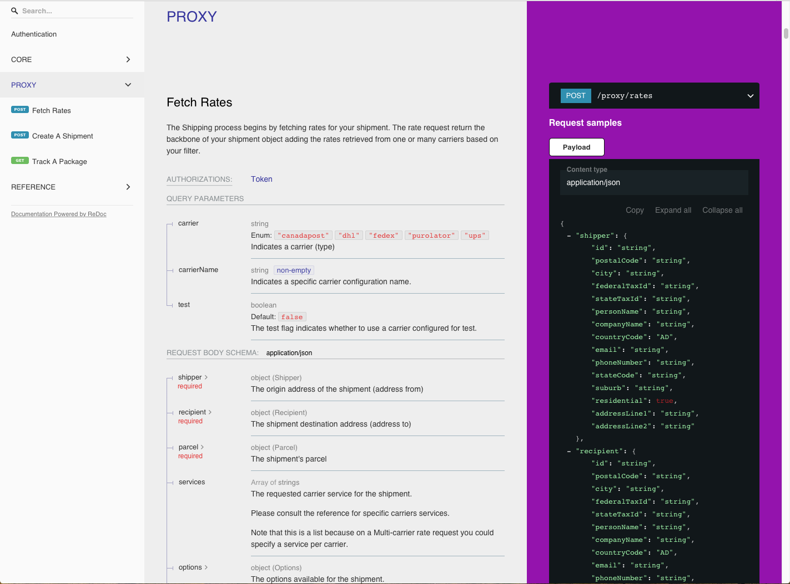

# What is PurplShip?

**PurplShip** is a **multi-carrier** service integration platform. The idea is to simplify the process of integrating
your logistic carrier services into your application using a modern and **simplified API**. Most of the major carriers
make their services available using web services. However, the developer experience with those web services is far
from convenient because, a majority of them are still using arcane technologies such as **SOAP** with **XML** data format
and notably very long and complex documentations.

**PurplShip** aims to lower the barrier of entry for carriers web service integration by proposing a unified interface
to communicate with all carriers, a modern API and a lightweight documentation.

PurplShip has two components:

- [PurplShip](https://github.com/PurplShip/purplship) **(aka purplship-lib)**

> A library that abstract and unify the carriers common services under one interface.

- [PurplShip-server](https://github.com/PurplShip/purplship-server)

> A private cloud REST API (service) for a deployment on premise or on public cloud platforms.


# Getting Started

For an introduction to shipping services integration, please take a look at [Shipping integration 101](/101).

PurplShip gets you started easily while offering advanced options for complex carrier services requirements.

### Install

```shell
pip install -f https://git.io/purplship purplship-server
```

### Start the server

```shell
purplship runserver
```

```
System check identified no issues (0 silenced).
April 20, 2020 - 11:58:20
Django version 3.0.5, using settings 'purpleserver.settings'
Starting development server at http://127.0.0.1:8000/
Quit the server with CONTROL-C.
```




### Add a carrier config

Open `http://127.0.0.1:8000/admin`
